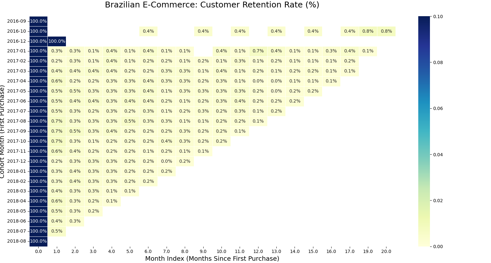

# 🛒 Brazilian E-Commerce Analytics Pipeline

*[Türkçe versiyonu aşağıdadır / Turkish version is below]*

## 📊 Live Dashboard
[Click here to view the Interactive Tableau Dashboard](https://public.tableau.com/app/profile/tuba.nur.demi.r/viz/BrezilyaE-TicaretSatAnalizi/Dashboard1?publish=yes)
---

## 📝 Project Overview (English)
This end-to-end data engineering and analytics project processes real-world e-commerce data from Brazil. The goal of this project is to build an automated ETL pipeline, model the data in a relational database, and create an interactive dashboard for actionable business insights.


## Repository Structure

```text
├── src/          # Python scripts for ETL and analytics
├── sql/          # SQL scripts for data modeling and analysis
├── images/       # Project visuals and generated charts
├── reports/      # Generated analysis outputs
└── README.md     # Project documentation
```

## 🛠️ Tech Stack
* **Python (Pandas, SQLAlchemy):** Data extraction, cleaning (handling time-traveling records and missing values), and loading.
* **PostgreSQL:** Relational database management and data modeling.
* **Tableau:** Interactive data visualization and business intelligence.

## 🔐 Security Practices

- Database credentials are managed using environment variables.
- The `.env` file is excluded from version control using `.gitignore`.
- A `.env.example` file is provided to show the required configuration format.
- Hardcoded database passwords were removed from Python scripts.

## ▶️ How to Run This Project

1. Clone the repository.
2. Install the required Python packages:

```bash
pip install -r requirements.txt
```
3. Create a `.env` file based on `.env.example` and update it with your PostgreSQL credentials.
4. Run the ETL pipeline:

```bash
python src/etl_pipeline.py
```
5. Run the analytics scripts:

```bash
python src/cohort_heatmap.py
python src/rfm_analysis.py
```

## ⚙️ Pipeline Architecture
1. **Extract:** Raw CSV data is ingested using Python.
2. **Transform:** Data quality issues are cleaned using Pandas. Orders are filtered to keep delivered records with valid delivery dates, and undefined payment types are removed from the payments table.
3. **Load:** Cleaned datasets are loaded directly into a PostgreSQL database.
4. **Model:** A SQL View (`master_satis_tablosu`) is created to join multiple tables for seamless BI integration.
5. **Visualize:** The optimized data is connected to Tableau to analyze sales performance, regional distribution, and payment methods.

### 🧠 Advanced Analytics
* **Cohort & Retention Analysis:** Wrote advanced SQL queries (CTEs, Date Functions) to track customer retention and calculate churn rates over time. You can view the SQL code [here](sql/cohort_analysis.sql).

## 📊 Advanced Analytics & Insights

### 1. Customer Retention (Cohort Analysis)
We modeled customer loyalty by tracking monthly purchase cohorts. The retention heatmap below highlights the classic e-commerce challenge where the vast majority of customers are one-time buyers:
[](images/cohort_retention_heatmap.png)

### 2. RFM Segmentation

The dataset was processed using a custom Python pipeline to evaluate customers based on Recency, Frequency, and Monetary metrics. The final segmented data has been exported as [`rfm_summary_report.csv`](reports/rfm_summary_report.csv) for targeted marketing campaigns.

### 3. Delivery Performance Analysis

Delivery performance was analyzed to understand how shipping delays affect customer satisfaction. The results show that late deliveries significantly reduce customer review scores.

| Metric | Result |
|---|---:|
| Average Delivery Time | 12.50 days |
| Late Delivery Rate | 8.11% |
| Avg Review Score - Late Orders | 2.57 |
| Avg Review Score - On-Time Orders | 4.29 |

The SQL queries for this analysis can be found [here](sql/delivery_performance_analysis.sql).
The Tableau dashboard for this analysis is available [here](https://public.tableau.com/app/profile/tuba.nur.demi.r/viz/DeliveryPerformanceDashboard_17797072613630/DeliveryPerformanceDashboard?publish=yes).---

## 📝 Proje Özeti (Türkçe)
Bu uçtan uca veri mühendisliği ve analitiği projesi, Brezilya'ya ait gerçek dünya e-ticaret verilerini işlemektedir. Bu projenin amacı; otomatik bir ETL boru hattı kurmak, veriyi ilişkisel bir veritabanında modellemek ve iş kararlarına yön verecek interaktif bir gösterge paneli (dashboard) oluşturmaktır.

## Proje Klasör Yapısı

```text
├── src/          # ETL ve analiz için kullanılan Python dosyaları
├── sql/          # Veri modelleme ve analiz için SQL dosyaları
├── images/       # Projede kullanılan görseller ve oluşturulan grafikler
├── reports/      # Analiz sonucunda oluşturulan rapor dosyaları
└── README.md     # Proje dokümantasyonu
```
## 🛠️ Kullanılan Teknolojiler
* **Python (Pandas, SQLAlchemy):** Veri çekme, temizleme (zaman yolculuğu yapan hatalı kayıtların ve eksik verilerin ayıklanması) ve yükleme.
* **PostgreSQL:** İlişkisel veritabanı yönetimi ve veri modelleme.
* **Tableau:** İnteraktif veri görselleştirme ve iş zekası.

## 🔐 Güvenlik Uygulamaları

- Veritabanı bağlantı bilgileri environment variable yapısı ile yönetildi.
- Gerçek `.env` dosyası `.gitignore` ile GitHub dışında bırakıldı.
- Gerekli yapılandırma formatını göstermek için `.env.example` dosyası eklendi.
- Python dosyalarındaki hardcoded veritabanı şifreleri kaldırıldı.

## ▶️ Proje Nasıl Çalıştırılır?

1. Repository bilgisayara indirilir.
2. Gerekli Python paketleri kurulur:

```bash
pip install -r requirements.txt
```
3. `.env.example` dosyası örnek alınarak bir `.env` dosyası oluşturulur ve PostgreSQL bağlantı bilgileri girilir.
4. ETL pipeline çalıştırılır:

```bash
python src/etl_pipeline.py
```
5. Analiz scriptleri çalıştırılır:

```bash
python src/cohort_heatmap.py
python src/rfm_analysis.py
```

  
## ⚙️ Boru Hattı Mimarisi (Pipeline Architecture)
1. **Extract (Çıkar):** Ham CSV verileri Python kullanılarak sisteme alınır.
2. **Transform (Dönüştür):** Veri kalitesi sorunları Pandas kullanılarak temizlenir. Sipariş tablosunda yalnızca teslim edilmiş ve geçerli teslimat tarihine sahip kayıtlar tutulur; ödeme tablosunda ise tanımsız ödeme türleri temizlenir.
3. **Load (Yükle):** Temizlenmiş veri setleri doğrudan PostgreSQL veritabanına yüklenir.
4. **Model (Modelle):** Kesintisiz BI (İş Zekası) entegrasyonu için birden fazla tabloyu birleştiren bir SQL Görünümü (`master_satis_tablosu`) oluşturulur.
5. **Visualize (Görselleştir):** Optimize edilmiş veri, satış performansını, bölgesel dağılımı ve ödeme yöntemlerini analiz etmek için Tableau'ya bağlanır.

### 🧠 İleri Düzey Analitik
* **Kohort ve Elde Tutma (Retention) Analizi:** Zaman içindeki müşteri sadakatini izlemek ve kayıp (churn) oranlarını hesaplamak için ileri seviye SQL sorguları (CTE'ler, Tarih Fonksiyonları) yazdım. İlgili SQL kodunu [buradan](sql/cohort_analysis.sql) inceleyebilirsiniz.

## 📊 İleri Seviye Veri Analitiği ve İçgörüler

### 1. Müşteri Elde Tutma (Cohort Analizi)
Müşteri sadakatini, aylık satın alma kohortlarını (gruplarını) takip ederek modelledik. Aşağıdaki elde tutma (retention) ısı haritası, müşterilerin büyük çoğunluğunun tek seferlik alıcı olduğu klasik e-ticaret problemini net bir şekilde ortaya koymaktadır:

[](images/cohort_retention_heatmap.png)

### 2. RFM Segmentasyonu
Veriseti; müşterileri Yenilik (Recency), Sıklık (Frequency) ve Parasal Değer (Monetary) metriklerine göre değerlendirmek ve sınıflandırmak için özel bir Python veri boru hattı (pipeline) kullanılarak işlendi. Hedefli pazarlama kampanyalarında kullanılmak üzere, segmentlere ayrılmış final rapor [`rfm_summary_report.csv`](reports/rfm_summary_report.csv) olarak dışa aktarıldı.

### 3. Teslimat Performansı Analizi

Teslimat performansı, kargo gecikmelerinin müşteri memnuniyetini nasıl etkilediğini anlamak için analiz edildi. Sonuçlar, geç teslim edilen siparişlerin müşteri yorum puanlarını belirgin şekilde düşürdüğünü göstermektedir.

| Metrik | Sonuç |
|---|---:|
| Ortalama Teslimat Süresi | 12.50 gün |
| Geç Teslimat Oranı | %8.11 |
| Geç Teslim Edilen Siparişlerin Ortalama Puanı | 2.57 |
| Zamanında Teslim Edilen Siparişlerin Ortalama Puanı | 4.29 |

Bu analiz için kullanılan SQL sorgularını [buradan](sql/delivery_performance_analysis.sql) inceleyebilirsiniz.
Bu analiz için hazırlanan Tableau dashboard'una [buradan](https://public.tableau.com/app/profile/tuba.nur.demi.r/viz/DeliveryPerformanceDashboard_17797072613630/DeliveryPerformanceDashboard?publish=yes) ulaşabilirsiniz.
